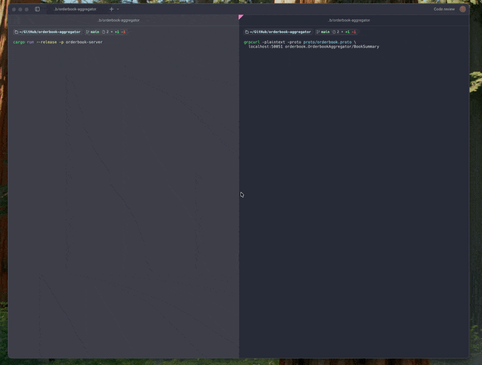
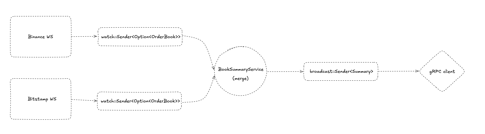

# Order Book Aggregator



A real-time order book aggregator that connects to Binance and Bitstamp simultaneously,
merges their order books, and streams the result via gRPC.

- [Order Book Aggregator](#order-book-aggregator)
  - [Quick Start](#quick-start)
  - [Architecture](#architecture)

## Quick Start

1. Install prerequisites:
- Rust (stable): https://rustup.rs/
- `protoc` (Protocol Buffers compiler):

```bash
# macOS
brew install protobuf

# Ubuntu / Debian
sudo apt-get update && sudo apt-get install -y protobuf-compiler
```

2. Run the server:

```bash
cargo run --release -p orderbook-server
```

Default runtime values:
- pair: `ethbtc`
- port: `50051`

3. Read the gRPC stream (from another terminal):

```bash
grpcurl -plaintext -proto proto/orderbook.proto \
  localhost:50051 orderbook.OrderbookAggregator/BookSummary
```

Example output:

```json
{
  "spread": 0.0000031,
  "bids": [
    { "exchange": "bitstamp", "price": 0.02973689, "amount": 0.0675 },
    { "exchange": "binance",  "price": 0.02973,    "amount": 67.24 },
    ...
  ],
  "asks": [
    { "exchange": "binance",  "price": 0.02974,    "amount": 26.22 },
    { "exchange": "bitstamp", "price": 0.02974947, "amount": 0.0675 },
    ...
  ]
}
```

## Architecture



- **`crates/orderbook-lib`** — pure domain logic: types and aggregation rules. No I/O.
- **`crates/orderbook-server`** — application/service wiring, gRPC server (tonic),
plus exchange transport/runtime infrastructure. Exchange-specific adapters live under `src/exchanges`,
shared websocket/runtime infrastructure under `src/exchange_infra`.

Each exchange runs in its own task with automatic reconnection. `tokio::sync::watch`
ensures the aggregator always works with the latest snapshot from each exchange without
accumulating stale updates. The aggregator reacts to changes via `tokio::select!`
and fans out to all connected gRPC clients via `broadcast`.

All state is held in-memory — order book data is inherently ephemeral and only
the current snapshot has value.
